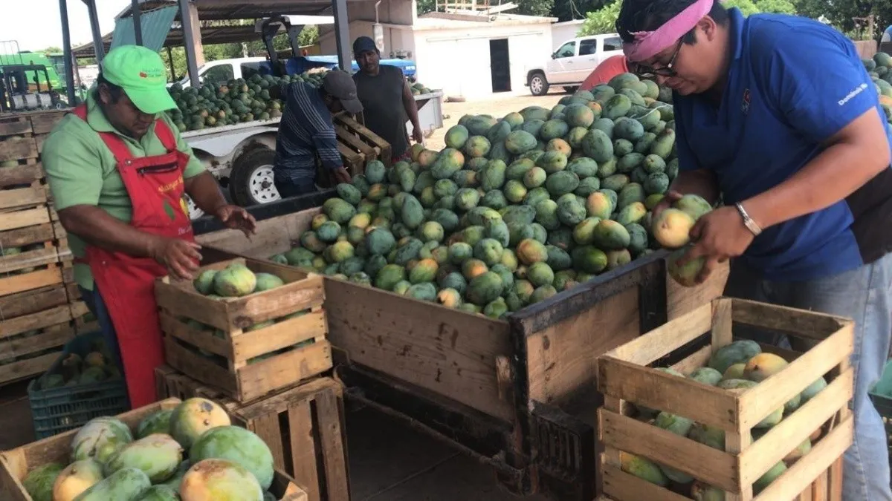
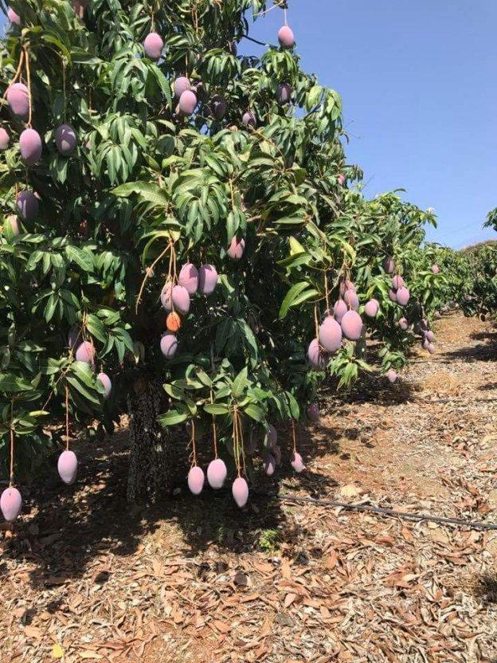

```{r setup, include=FALSE}
knitr::opts_chunk$set(warning = FALSE, message = FALSE, echo = TRUE, collapse = TRUE)
```

# Sustentabilidad de la producción de Mango en Sonora, México 

```{r, title-image, fig.align='center', fig.cap='Inicio de cosecha de mango'}

```

## **Introducción**

Para este caso de estudio analizaremos el cultivo que se planta en Sonora, su producción, cosecha, necesidades, basándonos en métodos estadísticos para saber su relación agrícola en el estado de Sonora, viendo lo que este estado puede cosechar y producir a lo largo de los años y veremos si vale la pena usar tantos recursos naturales para mantener la producción sustentable de estos cultivos y saber si sale rentable.

Veremos si la producción utiliza de buena manera la tierra, si los pasos necesarios se siguen correctamente para que los cultivos puedan dar su máxima producción potencial. la tierra idónea y su mantenimiento son necesarias para varios cultivos, además de que debe tener un cierto clima que no lo dañe, y sobre todo que se mantenga limpio, sin basura, residuos ni desperdicios, una vez visto estos sigue la formación de la tierra para dejarlo en condiciones óptimas para su plantación, además de poner la siembra en lugares estratégicos para tener un máximo de potencial, y obviamente el mantenimiento de la planta, su cuidado constante, y precauciones del clima para poder producirlo de la mejor manera y finalmente enviarlo a comercializar.

## **Antecedentes**

En el estado de Sonora se cultivan varias frutas que necesitan de climas cálidos y húmedos, para lo cual Sonora no es de las mejores opciones. En 2019 se cosechó en 23 estados del país con un volumen de producción 11.9% mayor al de 2018. Sinaloa, Guerrero, Nayarit y Chiapas generan dos terceras partes del volumen cosechado a nivel nacional. Los mangos y aguacates exigen mucha agua, y hace tiempo que el agua no sobra.

El Servicio de Información Agroalimentaria y Pesquera (SIAP), señala que este fruto se cosecha en 23 estados de la República Mexicana. Entre los principales productores se ubica Guerrero con un 22%, Nayarit con un 17% y Sinaloa con un 14%, que en conjunto suman el 53% de la producción nacional. El resto se proviene de Campeche, Chiapas, Colima, Jalisco, Michoacán, Oaxaca y Veracruz. Guerrero encabeza la lista gracias a su extensa superficie sembrada, así como al buen rendimiento del cultivo. Y esto solo hablando en términos del fruto del mango.

```{r, backgrounds-image, fig.align='center', fig.cap='Granja de mango'}

```

Sin embargo, en Sonora no se ve que haya una buena cosecha como en los otros estados; teniendo una producción de entre aproximadamente 1000 a 2500 toneladas de mango, lo cual es obviamente muy poco, las semillas de mango normalmente demoran 8 años en producir frutos. Los árboles jóvenes injertados demoran de 3 a 5 años en producir frutos; y es casi seguro que producirán una buena cosecha. Si bien los mangos no necesitan muchos cuidados cuando se los planta, sí necesitarán estar en circunstancias específicas para poder crecer. Los mangos crecen mejor en altas temperaturas y pueden soportar áreas húmedas, pantanosas o áridas.

## **Objetivos del trabajo**

A través del desarrollo del análisis, intentaremos responder estas preguntas ---

### **¿Cuáles son los cultivos más productivos en Sonora?**

Los más productivos en cuestión de valor de producción, son la Uva con un total de 35332692.04 miles de pesos, la Sandía con un total de 177125329.3, y el esparrago con un total de 28277113.75, miles de pesos promedio en los últimos 5 años, a lo cual asumimos que estos 3 cultivos son un gran ingreso para el estado de Sonora

### **¿Qué pasaría si en vez de sembrar Maíz y trigo como se hace tanto se sembrará tanto de uva o de espárrago?**

En términos económicos sería mucho más rentable dado que la siembra de maíz y trigo no da tanto dinero como la de las uvas, sacando un valor un poco menor para el trigo , contra la de la uva, aunque solamente en el año del 2015-2016 el trigo en grano se vio con un valor de producción un poco mayor al de la uva, que se fue plantando lo mismo pero se fue aumentando su valor de producción a comparación del trigo, y tomando en cuenta que en los demás años la Uva sigue siendo la que más genera valor de producción los valores serian prácticamente iguales con la uva siendo la que más ingresos aporta. (Esto se fundamenta con la gráfica 3)

### **¿Qué tanto se desperdicia?**

Si bien no es una cosa o variable que se pueda calcular fácilmente, lo que sí sabemos es que los agricultores aun teniendo cultivos buenos pero con diferentes tonos a lo que se cataloga como normales, no son entregados/vendidos a los proveedores ya que saben que estos no se venderán en el mercado y terminaran caducando, es por eso que aunque no se tenga una variable real como serian siniestrados si se sabe que en promedio se desechan muchas cantidades de cultivo que se regalan a familiares, amigos, etc. ya que en el mercado convencional no se venderían.

### **¿Como la lluvia y la temperatura afectan la producción?**

Un aumento en la temperatura acelerará el crecimiento. En el caso de un cultivo anual, el período entre la siembra y la cosecha se acortará (por ejemplo, el tiempo antes de la cosecha del maíz podría acortarse entre una y cuatro semanas). Esta situación podría afectar negativamente a la productividad debido a que la senescencia (dejarían de crecer y centrarse en el fruto, ergo nomas se centrarían en sobrevivir y no en producir) sucedería más temprano.

***

## **Teoría**

Es por este ejemplo en particular que **veremos si en Sonora se pueden cultivar alimentos de este tipo**; ya que al ser un lugar con clima caliente y seco no todas las plantas podrán crecer y dar frutos. Al no tener las condiciones apropiadas para crecer, los agricultores no se centran en producir frutos o alimento, ya que la falta de sus condiciones (ya sean de clima, agua, tierra, etc.) provocan dificultades de supervivencia en su area de cultivo, dificultando que estas puedan formar biomasa, no dando frutos como resultado.

**Veamos un ejemplo ---**

Conocemos que todas las plantas necesitan ciertas cantidades de agua, así que es de suma importancia tener un buen sistema
de riego y de alimentación, para aprovechar al máximo y eficientizar la necesidad de agua que ocupan las plantas, además de esto ocupan ciertas condiciones climatológicas ya que si sufren daños a causa de esto son más propensos a estropear la planta.

La agricultura en México es más que un sector productivo importante. Más allá de su participación en el PIB  nacional, que es de  apenas cerca del   3.7%, las múltiples funciones de la agricultura en el desarrollo económico, social y ambiental determinan que su incidencia en el desarrollo sea mucho mayor de lo que ese indicador implicaría. La agricultura es un sector relativamente pequeño en México, y sigue a la baja con respecto  a la  economía total  con  cerca del  3.7% del  PIB según  cifras preliminares del INEGI del 2014. (Corona Ramírez, 2016)

En Sonora la producción de uva de mesa es llevada a cabo por alrededor de 39 empresas productoras las cuales cultivan este fruto en una superficie aproximada de 19,015 hectáreas, ubicadas principalmente en Hermosillo, Caborca y en la localidad de Pesqueira perteneciente al municipio de San Miguel de Horcasitas. La producción de uva de mesa en el estado de Sonora asciende a aproximadamente 238,478 toneladas; esta producción corresponde a alrededor del 92% de la producción de uva de mesa a nivel nacional. (SIAP, 2013)

México tiene una muy buena y rica posición geográfica para la agricultura teniendo grandes cantidades de sol, tierra, agua y viento para los cultivos, debido a esto es necesario que se optimicen los recursos lo mejor posible, pudiendo usar herramientas tecnológicas para automatizar muchos procesos haciéndolos relativamente más efectivos, además también los granjeros de todos los cultivos tienen que cuidarse del cambio climático ya que puede y va a afectar negativamente a muchos que principalmente basan su economía en cultivos.(FAO 2014)

Es realmente importante saber cómo tomar decisiones en base a los datos que tenemos ya que con estos podremos tomar decisiones sobre los procesos mucho más seguros y así podemos deshacernos de la incertidumbre casi por completo al elegir un proceso en concreto.

En los últimos años, las tasas de crecimiento de la producción agropecuaria mundial y los rendimientos de los cultivos han disminuido. Esto ha suscitado temores de que el mundo no sea capaz de incrementar lo suficiente la producción de alimentos y otros productos para asegurar una alimentación adecuada de la población futura.

La disminución no se ha producido a causa de la escasez de tierra o agua, sino más bien debido a que la demanda de productos agropecuarios ha disminuido. Las tasas de crecimiento de la población mundial han ido disminuyendo desde finales de los años sesenta y en muchos países se están alcanzando ahora niveles bastante altos de consumo de alimentos per cápita, por encima de los cuales incrementos adicionales serán limitados. Además, una parte persistentemente alta de la población mundial sigue sumida en una pobreza absoluta y carece de los ingresos necesarios para transformar sus necesidades en una demanda efectiva. (FAO.org. 2018)

***

## **Estudio** {.tabset}

### **Metodología**

Métodos estadísticos que se utilizaran, junto a los métodos de los datos

* Estadística descriptiva: Para mostrar los datos de las cosechas que se están desperdiciando

* Análisis de series de tiempo (TSA): para saber cómo evoluciona la economía agrícola en Sonora, una serie temporal se define como una colección de observaciones de una variable recogidas secuencialmente en el tiempo.

* Correlación de Pearson: para la covarianza estandarizada de la muestra aplicada.

***

### **Operaciones**

Hipotesis

* H0: Las variables son independientes por lo que una variable no varía entre los distintos niveles de la otra variable.
* H1: Las variables son dependientes, una variable varía entre los distintos niveles de la otra variable.

***

# **Datos**

### **Paquetes a utilizar**

```{r, set-packages}
library(pacman)
p_load(rmdformats, readr, readxl, ggplot2, plotly, DT, xfun, gridExtra, leaflet, GGally, psych, corrplot, cluster, plotly, gapminder)
```

***

### **Producción de cultivos al año en Sonora**

```{r, yearly-crop-production-sonora}
produccionTotalNacional <- read_xlsx("ProduccionTotalNacional_2015-2020.xlsx")
produccionTotalSonora <- dplyr::filter(produccionTotalNacional, ENTIDAD == "Sonora")
produccionTotalSonora <- data.frame(produccionTotalSonora)
produccionTotalSonora
```

***

### **Temperaturas anuales de Sonora**

```{r, yearly-temperature-sonora}
temp <- data.frame(produccionTotalSonora$YEAR, produccionTotalSonora$TemperaturaAnual, produccionTotalSonora$PrecipitacionMedia)
temp
```

***

## **Visualizacion de datos**

### **Tabla de producción de cultivos al año en Sonora**

```{r, datatable-total-sonora}
datatable(produccionTotalSonora)
```

***

### **Tabla de temperaturas y mm´s de lluvia al año en Sonora**

```{r, datatable-temperature-sonora}
datatable(temp)
```

***

### **Mostrando datos**

```{r, show-data}
produccionTotalNacional <- read_xlsx("ProduccionTotalNacional_2015-2020.xlsx")
produccionTotalSonora <- dplyr::filter(produccionTotalNacional, ENTIDAD == "Sonora")
produccionTotalSonora <- data.frame(produccionTotalSonora)
produccionTotalSonora
```

***

## **Correlación Pearson**

### **Gráfica 1**

```{r, graphic-1-pearson}
multi.hist(x = produccionTotalSonora[-c(1:3,5:6,8:9,13)], dcol = c("blue", "red"), dlty = c("dotted", "solid"), main = "")
```

Como podemos observar los datos que en orden son:

1. Cosechada
2. Producción
3. Valor de producción
4. Temperaturas
5. Lluvias

No parecen ser normales del todo; ya que lo único que muestra algo de normalidad es la 3ra y en la parte económica de los cultivos.

Con esto podemos decir que el valor de produccion del Mango, Esparrago, Uva, Maiz y Trigo nos regresa una ganancia similar a traves de los años 2015 al 2020, esto genera la pregunta ¿Se refleja cuanto se cosechó, la temperatura, o si llovio en la produccion, y sobre todo en el valor de dicha produccion? Esto nos ayudaria a visualizar la importancia del cambio climatico en los cultivos especificados y si realmente afecta en el mercado. Para responder esta pregunta necesitamos ver que tanta relacion tienen entre si  utilizando la Correlacion de Pearson la cual nos muestra una variedad de graficos comparando cada dato entre si.


Ahora veamos una correlación de Pearson

### **Gráfica 2**

```{r, graphic-2-pearson}
filtroSon <- produccionTotalSonora[-c(1:3,6,8:9)]

ggpairs(filtroSon, lower = list(continuous = "smooth"),
        diag = list(continuous = "barDiag"), axisLabels = "none")
```

Podemos observar como la producción esta algo relacionada con lo que puede ser la temperatura y las lluvias, esto porque tanto una y otra ayudan o perjudican a los cultivos ya que necesitan de ciertos climas y cierta cantidad de agua.

***

```{r, filter-pearson}
filtroSon <- produccionTotalSonora[-c(1:3,6,8:9)]

round(cor(x = filtroSon, method = "pearson"),3)
```

Podemos ver que la parte de producción y en general la siembra y cosecha tiene una relación inversamente proporcional lo cual no afecta realmente porque el que plantemos más cultivos o no quiere decir que llueva más o menos, en el caso de la temperatura sí que podría afectar por todos los tratamientos tanto químicos como de mantenimiento que necesita el cultivo.

***

## **Análisis de series de tiempo para los cultivos**

### **Gráfica 3**

```{r, tsa-crops}
df <- produccionTotalSonora

fig <- df %>%
  plot_ly(
    x = ~COSECHADA, 
    y = ~VALORPRODUCCION, 
    size = ~VALORPRODUCCION, 
    color = ~CULTIVO,
    colors= rainbow(5),
    frame = ~YEAR, 
    text = ~CULTIVO, 
    hoverinfo = "text",
    type = 'scatter',
    mode = 'markers'
  )
fig <- fig %>% layout(
    xaxis = list(
      type = "log"
    )
  )

fig
```

En el gráfico anterior se observa como en 2015 el trigo en sonora se producía de una buena manera con un valor de producción de más de 6 millones de pesos, para el 2016 el trigo se veía que va que por buen camino ya que aumento su valor de producción unos cientos de miles, para el 2017 este se quedó donde mismo mientras que la uva y el esparrago dieron un gran paso en su producción y su valor de producción, de 5 a más de 6 millones y de un poco más de 4 millones a casi 6 millones respectivamente. Para el 2018 el precio de producción de uva y de esparrago seguía creciendo mientras que el del trigo tenía una caída, para el 2019 y el 2020 el trigo y el esparrago subieron muy poco en su valor de producción la uva se ha mantenido en el tope y su valor de producción solamente a crecido bastante en los últimos 5 años.

***

```{r, graphics-crops}
produccionTotalSonoraUva <- produccionTotalSonora[25:30, 2:13]
produccionTotalSonoraEsparr <- produccionTotalSonora[1:6, 2:13]
produccionTotalSonoraTrigo <- produccionTotalSonora[19:24, 2:13]
produccionTotalSonoraMaiz <- produccionTotalSonora[7:12, 2:13]
produccionTotalSonoraMango <- produccionTotalSonora[13:18, 2:13]

g1 <- ggplot(data = produccionTotalSonoraUva)+
  geom_line(aes(x = YEAR, y = VALORPRODUCCION), color = "Purple") +
  labs(title = "TS de uvas", x = "Años", y = "Val. Producción")

g2 <- ggplot(data = produccionTotalSonoraEsparr)+
  geom_line(aes(x = YEAR, y = VALORPRODUCCION), color = "Dark Green") +
  labs(title = "TS de esparragos", x = "Años", y = "Val. Producción")

g3 <- ggplot(data = produccionTotalSonoraTrigo) +
  geom_line(aes(x = YEAR, y = VALORPRODUCCION), color="brown") +
  labs(title = "TS de trigo", x = "Años", y = "Val. Producción")

g4 <- ggplot(data = produccionTotalSonoraMaiz) +
  geom_line(aes(x = YEAR, y = VALORPRODUCCION), color = "Yellow") +
  labs(title = "TS de maiz", x = "Años", y = "Val. Producción")

g5 <- ggplot(data = produccionTotalSonoraMango) +
  geom_line(aes(x = YEAR, y = VALORPRODUCCION), color = "Orange") +
  labs(title = "TS de mangos", x = "Años", y = "Val. Producción")

g6 <- ggplot(data = produccionTotalSonora) +
  geom_line(aes(x = YEAR, y = PrecipitacionMedia), color = "dark blue") +
  labs(title = "TS de lluvias", x = "Años", y = "Precipitación (milímetros)")

g7 <- ggplot(data = produccionTotalSonora) +
  geom_line(aes(x = YEAR, y = TemperaturaAnual), color="dark red") +
  labs(title = "TS de Temperaturas", x = "Años", y = "Celcius")

grid.arrange(g1,g2,g3,g4,g5,g6,g7)
```

Se puede ver, que en las fechas o en las zonas en donde las lluvias se mantienen, la producción de valor parece aumentar, aunque no quiere decir que estén estrechamente relacionadas del todo, ya que vimos que con las temperaturas la producción de valor de los cultivos como la uva, mangos, maíz parecen tener un paro y algunos decaen, por ende se podría decir que en efecto se da el caso de la senescencia, esto afecta a la generación de valor de los cultivos, lo cual es lógico, ya que sino hay una temperatura adecuada y/o agua necesaria, provocaría que la planta no enfocara sus fuerzas en dar frutos sino en sobrevivir los climas y en general el ambiente en el que esta, haciendo que se coseche menos y por ende se venda menos, esto por supuesto bajaría el valor de producción de los cultivos, incluso se podría sembrar menos porque no se contaran con los parámetros adecuados para los cultivos.

Ademas de esto en la parte de las lluvias se puede observar que cada vez llueve mas, lo cual es bastante bueno, sin embargo, esto no es del todo perfecto ya que si bien esta lloviendo mas, las temporadas son mas cortar actualmente la temporada más mojada dura 4.6 meses, de 28 de mayo a 15 de octubre, con una probabilidad de más del 46 % de que cierto día será un día mojado. El mes con más días mojados en Sonora es agosto, con un promedio de 24.0 días con por lo menos 1 milímetro de precipitación, esto quiere decir que lo que antes duraba una temporada de lluvia en un promedio de 5.2 meses, ahora te llueve en un promedio de 4.6 lo cual es preocupante ya que las plantas se ahogan de golpe o se marchitan en la espera alterando los ciclos de los cultivos.

***

```{r, scatter-production, warning = FALSE}
produccionTotalNacional <- read_xlsx("ProduccionTotalNacional_2015-2020.xlsx")
produccionTotalNacional <- dplyr::filter(produccionTotalNacional, YEAR == 2020)
produccionTotalNacional <- data.frame(produccionTotalNacional)

filtroNacional <- produccionTotalNacional

plot_ly(data = filtroNacional, x = ~TemperaturaAnual, y = ~VALORPRODUCCION, color = ~ENTIDAD, colors = rainbow(30), size = ~COSECHADA, type = "scatter") %>%
  layout(
    xaxis = list(title = "X"), 
    yaxis = list(title = "Miles de pesos"),
    showlegend = TRUE
  )
```

Explicación

***

## **Regresión Logística**

Sonora es conocido por ser principalmente un poco caluroso y seco mayor parte del año, es por eso que a una fruta tropical como lo seria el mango le seria muy dificil crecer en este clima, es por eso que analizaremos las condiciones que necesita esta fruta para crecer:

Iniciando por las temperaturas, el rango para que el mango cresca es de un mininmo de 27 a 45 grados celcius aproximadamente, a lo que Sonora no llega, teniendo una media de 21 aproximadamente a travez de todo el año.

Ahora veamos las cantidades de agua que necesita, es conocido que el mango consume mucha agua para que pueda dar frutos, necesitando un aproximado de 665 mm´s necesarios en ciertas candiades a travéz de los meses

Mes           | mm's
------------- | -------------
Septiembre    | 50 mm
Octubre       | 85 mm
Noviembre     | 110 mm
Diciembre     | 140 mm
Enero         | 140 mm
Febrero       | 140 mm

Sonora llega a tener una media de 420 en sus precipitaciones, lo cual no es favorable para la producción del mango.

```{r, read-mango-data-sonora}
datos <- read_excel("ProduccionSonoraMango.xlsx")
datos
```

***

## **Frecuencia de defectos en la temperatura**

```{r, table-defects-temperature}
tablaTemp <- table(datos$DEFECTOSTEMP)
tablaTemp
```

Podemos ver que no hay temperaturas extremas o preocupantes para el cultivo de mango

***

## **Frecuencia de defectos en la precipitación**

```{r, table-defects-rainfall}
tablaPrecip <- table(datos$DEFECTOSPRECIP)
tablaPrecip
```

Sin embargo podemos ver como en ningún momento podemos saciar la necesidad de agua para el mango a lo largo del año.

***

## **Gráfica de temperaturas**

```{r, temperature-graphic}
colores <- NULL
colores[datos$DEFECTOSTEMP == 0] <- "green"
colores[datos$DEFECTOSTEMP == 1] <- "red"

plot(datos$TEMPANUAL, datos$DEFECTOSTEMP, pch = 21, bg = colores, 
    xlab = "Temperatura", ylab = "Probabilidad de defectos")
legend("bottomleft", c("No defecto", "Si defecto"), pch = 21, col = c("green", 
    "red"))
```

***

## **Gráfica de precipitaciones**

```{r, rainfall-graphic}
colores <- NULL
colores[datos$DEFECTOSPRECIP == 0] <- "green"
colores[datos$DEFECTOSPRECIP == 1] <- "red"

plot(datos$PRECIPITACIONMEDIA, datos$DEFECTOSPRECIP, pch = 21, bg = colores, 
    xlab = "mm´s de lluvia", ylab = "Probabilidad de defectos")
legend("bottomleft", c("No defecto", "Si defecto"), pch = 21, col = c("green", 
    "red"))
```

Parece razonable, a la vista de los cultivos, pensar que las temperaturas y lluvias puede influir en la producción de los mangos, ya que si estos no tienen cumplidas sus necesidades, no creceran, no crearan biomasa, y no se centraran en dar frutos sino en sobrevivir. Luego la idea es ajustar por medio de la regresión logistica,un modelo de regresión logística para estudiar la posible relación entre Y=1 dado diferentes valores de temperatura/precipitación: P(Y=1|X). Para ajustar el modelo se usa el comando glm (para modelos lineales generalizados) indicando que la respuesta es binomial mediante el argumento family:

```{r, summary-temperature-regression}
regresionTemp <- glm(DEFECTOSTEMP ~ TEMPANUAL, data = datos, family = binomial)
summary(regresionTemp)
```

```{r, summary-rainfall-regression}
regresionPrecip <- glm(DEFECTOSPRECIP ~ PRECIPITACIONMEDIA, data = datos, family = binomial)
summary(regresionPrecip)
```

La formula del modelo de regresion logistica es:

$$P(Y=1|X)=\dfrac{e^{15.0429-0.2322x}}{1+e^{15.0429-0.2322x}}$$

***

## **Data frame de los datos** {.tabset}

```{r, unused-mango-dataframe}
#mangoFrame <- data.frame(sonoraMango, check.names = F)
#mangoFrame

#filtroMango <- mangoFrame[-c(1,6,11,12)]
#filtroMango
```

### **Correlación**

```{r, unused-mango-correlation}
#ggpairs(filtroMango, lower = list(continuous = "smooth"),
#        diag = list(continuous = "barDiag"), axisLabels = "none")
```

***

### **Indice de correlación de pearson**

```{r, unused-mango-filter}
#round(cor(x = filtroMango, method="pearson"),3)
```

```{r, unused-mango-histogram}
# ARREGLAR HISTORGRAMA
#multi.hist(x = filtroMango, dcol = c("blue", "red"), dlty = c("dotted", "solid"), main = "")
```

```{r, unused-mango-plotly, warning= FALSE}
#plot_ly(data = sonoraMango, x = ~YEAR, y = ~VALORPRODUCCION, color = ~YEAR, colors = rainbow(12), size = ~YEAR, type = "scatter") %>%
#  layout(
#    xaxis = list(title="Precipitación"), 
#    yaxis = list(title="Pesos"),
#    showlegend = TRUE
#  )
```

***

# **Conclusión**

Sonora como todos los estados tiene sus partes en la agricultura que cumplen con las condiciones perfectas para la siembra, cosecha y venta de muchos cultivos, sin embargo, como en todos los estados este siembra u obliga a sembrar cultivos que no son capaces de dar frutos en este ambiente ya que no se dedican a eso, a dar frutos, sino que se dedican a sobrevivir, ergo no crean biomasa y no generan ninguna ganancia para los agricultores que se enfocan en este tipo de cultivos, además de que podemos dejar en claro que las lluvias y temperaturas si tienen su efecto en los cultivos apropiados pero que si por alguna casualidad cambian de niveles pueden hasta provocar que las cosechas se arruinen y que los ciclos que llevan se estropeen dificultando la siguiente cosecha.

Suponemos que en el ambiente agrícola se está teniendo un poco de des estimación o menosprecio en cuanto a avances científicos ya que mayoría de los agricultores son muy obstinado o simplemente se rehúsan a un cambio además de los propietarios/inversionistas que se aferran a lo que quieren, aunque no les dé una ganancia real, pero ya es tiempo de aplicar la ciencia en esta área ya que es un gran recurso económico del país.

***

## **Descarga de datos y código** {.tabset}

### **Codigo**

```{r, download-code}
xfun::embed_file("ProyectoFinalAgricultura.Rmd")
```

***

### **Datos**

```{r, download-data}
#Producción de varios cultivos en México
xfun::embed_file("~/GitHub/ProduccionMango/Final/Datos por estado/Cultivos/ProduccionTotalNacional_2015-2020.xlsx")

#Producción de mangos en Sonora
xfun::embed_file("ProduccionSonoraMango.xlsx")

#Producción de mango
xfun::embed_file("ProduccionMangos.xlsx")

#Temperaturas de México
xfun::embed_file("TemperaturasPromAnualPorEstado.xlsx")
```

***

## **Bibliografía**

SERVICIO DE INFORMACIÓN AGROALIMENTARIA Y PESQUERA (SIAP). (2020). Panorama Agroalimentario. México: Agricultura Secretaria de agricultura y desarrollo rural. Recuperado 21 de noviembre de 2021, de https://www.inforural.com.mx/wp-content/uploads/2020/11/Atlas-Agroalimentario-2020.pdf

Agricultura mundial: hacia los años 2015/2030. (s. f.). FAO.org. Recuperado 21 de noviembre de 2021, de https://www.fao.org/3/y3557s/y3557s03.htm

SAGARPA. (2017). Planeación Agrícola Nacional: Mango Mexicano 2017-2050. México: SAGARMA. https://www.gob.mx/cms/uploads/attachment/file/257078/Potencial-Mango.pdf

National Department of Agriculture. (s. f.). mango. Recuperado 23 de noviembre de 2021, de https://www.nda.agric.za/docs/infopaks/mango.htm

Sonora Climate, Weather By Month, Average Temperature (Mexico) - Weather Spark. (s. f.). Weather Spark. Recuperado 23 de noviembre de 2021, de https://weatherspark.com/y/8716/Average-Weather-in-Sonora-Mexico-Year-Round

Luis Israel Chávez Guzmán. (Septiembre 2016). REINGENIERÍA DE PROCESOS EN EL USO DE MANO DE OBRA EN LA PRODUCCIÓN DE UVA DE MESA. Hermosillo Sonora: COORDINACIÓN DE DESARROLLO REGIONAL. Recuperado 23 de noviembre de 2021, de https://ciad.repositorioinstitucional.mx/jspui/bitstream/1006/782/1/Ch%C3%A1vez-Guzm%C3%A1n%20L%20I_MDR_2016.pdf

Corona Ramírez, I. (2016, 24 enero). El desarrollo de la agricultura y el impacto que tendría en las finanzas públicas de México. vLex. Recuperado 5 de diciembre de 2021, de https://vlex.com.mx/vid/desarrollo-agricultura-impacto-finanzas-679171833

* Fuente de datos

  + http://infosiap.siap.gob.mx/gobmx/datosAbiertos.php

  + https://nube.siap.gob.mx/cierreagricola/

  + http://dgeiawf.semarnat.gob.mx:8080/ibi_apps/WFServlet?IBIF_ex=D3_AGUA01_01&IBIC_user=dgeia_mce&IBIC_pass=dgeia_mce&NOMBREENTIDAD=*&NOMBREANIO=*

## **Teoría**

* https://www.inforural.com.mx/wp-content/uploads/2020/11/Atlas-Agroalimentario-2020.pdf
* https://avogoconsulting.com/subtropicales/4-condiciones-ambientales-claves-para-mango/

```{r, notes, include=FALSE, eval=FALSE, echo=FALSE}
"Notas:
En la metodología poner porque usaremos, que es y las formulas:

Metodología:

En este caso se trabajarán con estos métodos estadísticos

* Estadística descriptiva

* Correlación lineal

* Correlación lineal múltiple

* Análisis de normalidad de Shapiro-Wilk

* Correlación de pearson

* Regresión lineal simple

* Regresión lineal polinomios

¿Como nuestro caso de estudio influye a decisiones?

Valor de producción, trigo, CO2


Datos a tomar en cuenta

Sonora casi no cosecha nada de mango
El clima en Sonora puede ser bueno para el mango
hay falta de agua por eso casi no se cosecha

Parametros de temperaturas para el mango
min > 5 grados
max < 45 grados
rango perfecto 27>x<45

Media de agua al año para el mango
665 mm 

las fechas en Y en lugar de X

LA REGRESIÓN LOGISTICA NO NOS SIRVE YA QUE NO PODEMOS UTILIZAR UNA LOGICA BINOMIAL

porque se cultivan mas cosas que no dan tanto dinero?

PREGUNTAS FUNDAMENTALES

que cuesta mas producir?
poner mas cultivos
años mas calietnes hay menos producción? viceversa
años con mas lluvia mas producción?, viceversa

PRINCIPAL
¿Qué en realidad se tendría que sembrar en Sonora?


caja bigote, serie temporal

Mirar para evitar atorarse
https://es.r4ds.hadley.nz/explorar-introduccion.html


SE ENTREGA: miercoles 8-viernes 10"
```